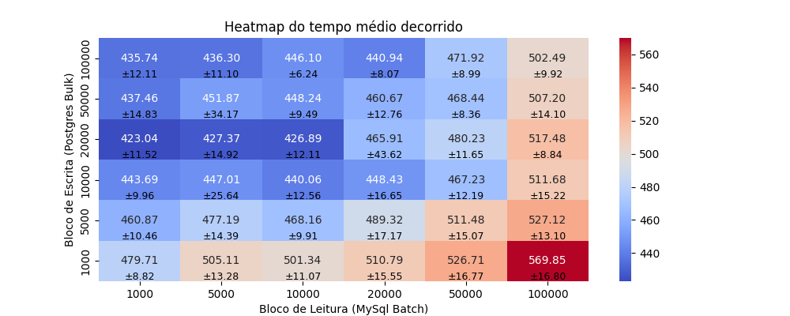

# Análise de Dados com Heatmaps

Este repositório contém os materiais e análises realizadas no estudo de padrões em datasets utilizando heatmaps. A análise é realizada através de um Jupyter Notebook que demonstra a aplicação de técnicas de visualização de dados para entender melhor as correlações entre variáveis.

## Estrutura do Repositório

- `testes_estatísticos.ipynb`: Jupyter Notebook com o código utilizado para gerar os heatmaps e realizar a análise de dados.
- `heatmap2.png`: Imagem do heatmap gerado como parte da análise. Este heatmap é discutido em detalhes no artigo e no notebook.

## Como Usar

Para executar o Jupyter Notebook incluído, siga estes passos:

1. Certifique-se de que você tem Jupyter Notebook instalado em seu ambiente. Se não, você pode instalar através do comando `pip install notebook`.
2. Clone este repositório para sua máquina local usando `git clone https://github.com/VicMisael/IDataMig/`.
3. Navegue até o diretório do repositório clonado.
4. Entre na Pasta 'Analise-Dados-Artigo'
4. Execute `jupyter notebook` para iniciar o Jupyter Notebook.
5. Abra o arquivo `testes_estatísticos.ipynb` dentro do Jupyter Notebook para ver o código e executá-lo.

## Visualizações

A imagem abaixo é uma das visualizações criadas durante a análise:

